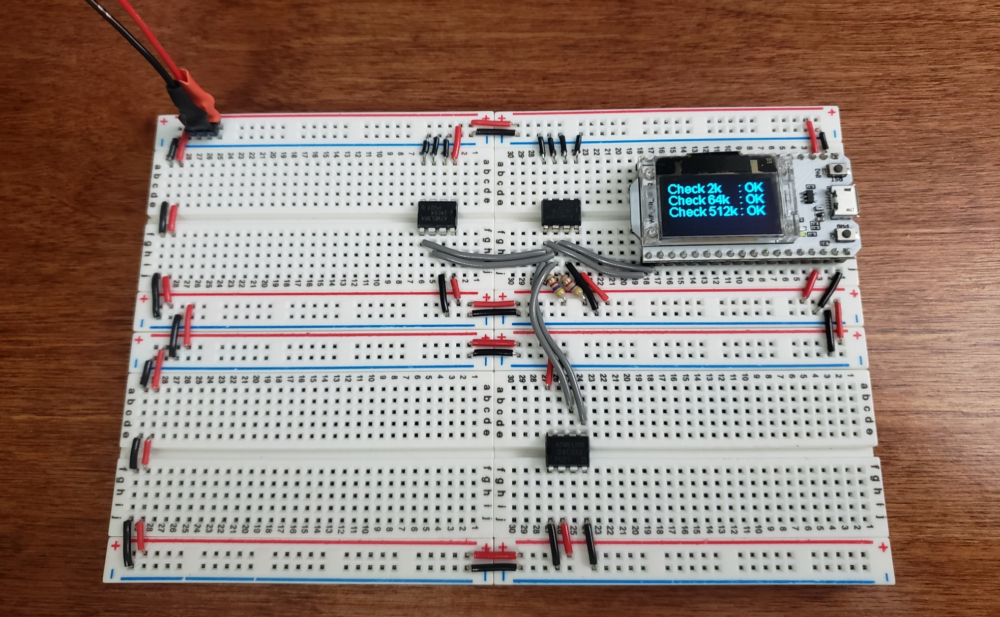
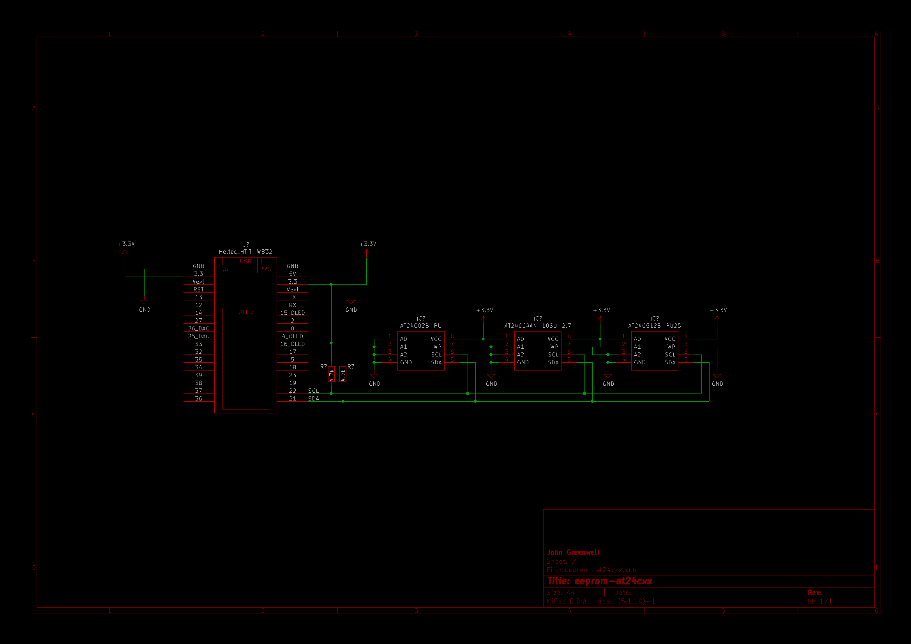

# EEPROM AT24CXX Library Project

Custom Library for AT24CXX EEPROM Chips

## Overview

This test project demonstrates a custom library capable of extended write/read operations on Microchip (formerly Atmel) [AT24CXX Series EEPROM](https://www.digikey.com/en/products/detail/microchip-technology/AT24C512-10PI-2-7/523467) chips. Though the AT24CXX family of EEPROM chips are internally organized according to varied page sizes, use of this class abstracts away the page-access arrangement such that extended strings and arrays of arbitrary length may be written contiguously across any address within the memory.



With the library controling write/read operations across pages, extended memory access is permitted according only to start address and desired length. This demonstration test is performed using a [Heltec Wifi Kit 32](https://heltec.org/project/wifi-kit-32/) microcontroller with OLED for textual readout of results, as shown. The test code for this test setup is provided in [main.cpp](src/src/main.cpp)

## Usage

Control of the EEPROM chip is accomplished through the [at24cxx.h](src/src/at24cxx.h) class instantiation and after a call to the *begin( )* method specifying the type of EEPROM chip, its externally-biased address, and the *TwoWire* I2C object for its given port.

```cpp
#include "at24cxx.h"
...
PeripheralIO::AT24CXX eeprom_512k;
...
Wire1.begin(SDA_PIN, SCL_PIN, 0);
eeprom_512k.begin(PeripheralIO::AT24C512, ADDR, Wire1);
...
// Check connection status
if (eeprom_512k.isConnected()) {
...
    eeprom_512k.write(START, TEST_STRING, LENGTH);
...
    eeprom_512k.read(START, str, LENGTH);
...
}
```

The *isConnected( )* method allows confirmation by acknowledgement from the chip prior to subsequent operations, if desired.

Each *write( )* and *read( )* method similarly returns a boolean true for finished operation, or false if an invalid address or boundary violation were to be attempted.

As specified in the [at24cxx.h](src/src/at24cxx.h) header file, the following AT24CXX Series EEPROM chips are supported, with all but two confirmed by testing:

```cpp
// Chip Selection
extern const uint32_t AT24C01; // Not tested
extern const uint32_t AT24C02;
extern const uint32_t AT24C04; // Not tested
extern const uint32_t AT24C08;
extern const uint32_t AT24C16;
extern const uint32_t AT24C32;
extern const uint32_t AT24C64;
extern const uint32_t AT24C128;
extern const uint32_t AT24C256;
extern const uint32_t AT24C512;
```
Optionally, a write protection pin may be specified as a fourth argument to the *begin( )* method, and the simple controls *setWriteProtect( )* and *clearWriteProtect( )* may be applied to raise or ground the write protect pin, respectively.

## Schematic

The overall schematic for the test setup, along with its associated CAD files are included as composed in KiCad 5.



## License

MIT © 2022 John Greenwell